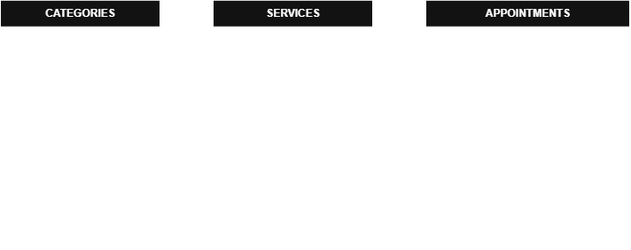

# AgendaPro API

## 1. Nome e descrição do projeto

**AgendaPro** é uma API REST para o domínio de prestação de serviços, como salões, barbearias, clínicas ou pequenos negócios.

O projeto resolve a necessidade de organizar os serviços oferecidos e os horários de atendimento. A API permite cadastrar categorias, serviços e agendamentos de clientes, mantendo os dados persistidos no Supabase/PostgreSQL.

Além da API, o projeto possui uma interface web simples para demonstrar o uso das operações de cadastro e gerenciamento dos dados.

## 2. Integrantes da equipe

- Cibely Godoy Martins

## 3. Tecnologias utilizadas

- Node.js
- TypeScript
- Express
- Supabase
- PostgreSQL
- HTML5, CSS3 e JavaScript
- Postman
- Git e GitHub

## 4. Entidades e relacionamento

O sistema possui três entidades relacionadas:

```text
Categoria (1) ──< Serviço (1) ──< Agendamento
```

Uma categoria pode possuir vários serviços, mas cada serviço pertence a uma única categoria. Um serviço pode possuir vários agendamentos, mas cada agendamento pertence a um único serviço.

### Categoria (`categories`)

| Atributo | Tipo | Descrição |
| --- | --- | --- |
| `id` | UUID | Identificador único da categoria (PK). |
| `name` | VARCHAR(100) | Nome da categoria. |
| `description` | TEXT | Descrição da categoria. |
| `active` | BOOLEAN | Indica se a categoria está ativa. |

### Serviço (`services`)

| Atributo | Tipo | Descrição |
| --- | --- | --- |
| `id` | UUID | Identificador único do serviço (PK). |
| `category_id` | UUID | Categoria à qual o serviço pertence (FK). |
| `name` | VARCHAR(100) | Nome do serviço. |
| `description` | TEXT | Descrição do serviço. |
| `price` | NUMERIC(10,2) | Preço do serviço. |
| `duration_minutes` | INTEGER | Duração estimada, em minutos. |
| `active` | BOOLEAN | Indica se o serviço está disponível. |

### Agendamento (`appointments`)

| Atributo | Tipo | Descrição |
| --- | --- | --- |
| `id` | UUID | Identificador único do agendamento (PK). |
| `service_id` | UUID | Serviço agendado (FK). |
| `client_name` | VARCHAR(120) | Nome do cliente. |
| `client_phone` | VARCHAR(20) | Telefone do cliente. |
| `scheduled_at` | TIMESTAMPTZ | Data e horário do atendimento. |
| `status` | VARCHAR(20) | Situação: `agendado`, `concluido` ou `cancelado`. |
| `notes` | TEXT | Observações adicionais. |

### Diagrama entidade-relacionamento



## 5. Estrutura do projeto

```text
AgendaPro/
├── database/
│   └── schema.sql                 # tabelas, relacionamentos e restrições
├── docs/
│   ├── AgendaPro.postman_collection.json
│   └── diagrama-entidade.drawio.png
├── public/
│   ├── index.html                 # interface web
│   ├── style.css                  # estilos da interface
│   └── app.js                     # comunicação com a API
├── src/
│   ├── config/
│   │   └── supabase.ts            # conexão com o Supabase
│   ├── controllers/               # validações e respostas HTTP
│   ├── models/                    # operações com o banco de dados
│   ├── routes/                    # definição das rotas
│   ├── app.ts                     # configuração do Express
│   └── server.ts                  # inicialização do servidor
├── .env.example
├── .gitignore
├── package.json
└── README.md
```

## 6. Configuração e execução

### Pré-requisitos

- Node.js 20 ou superior;
- uma conta e um projeto criados no Supabase;
- Git;
- Postman, recomendado para executar a coleção de testes.

### Instalação

Clone o repositório e instale as dependências:

```bash
git clone https://github.com/CibelyMartins/AgendaPro.git
cd AgendaPro
npm install
```

Crie o arquivo `.env` a partir do arquivo de exemplo:

```bash
copy .env.example .env
```

> Em macOS ou Linux, use `cp .env.example .env`.

Depois de configurar as variáveis de ambiente e o banco de dados, inicie a aplicação:

```bash
npm run dev
```

Acesse `http://localhost:3000` para utilizar a interface web. As rotas da API continuam disponíveis, por exemplo, em `http://localhost:3000/categories`.

Para gerar a versão compilada em TypeScript:

```bash
npm run build
```

## 7. Variáveis de ambiente

As variáveis obrigatórias estão exemplificadas no arquivo `.env.example`:

```env
PORT=3000
SUPABASE_URL=https://seu-projeto.supabase.co
SUPABASE_SECRET_KEY=sua_chave_do_supabase
```

O arquivo `.env` contém as credenciais reais e está protegido pelo `.gitignore`. Ele não deve ser enviado ao GitHub.

## 8. Banco de dados

O banco de dados utiliza Supabase/PostgreSQL. O script completo para criação das tabelas, chaves estrangeiras e regras de integridade está em [database/schema.sql](database/schema.sql).

No painel do Supabase, abra o **SQL Editor**, cole o conteúdo desse arquivo e execute-o antes de iniciar a API.

Além das chaves estrangeiras, o banco aplica as seguintes regras:

- `categories.name` é único;
- `services.price` e `services.duration_minutes` devem ser maiores que zero;
- um serviço não pode ser excluído se possuir agendamentos vinculados;
- uma categoria não pode ser excluída se possuir serviços vinculados;
- não pode existir sobreposição de horários para o mesmo serviço: a API considera a duração do serviço e ignora agendamentos cancelados.

## 9. Documentação dos endpoints

### Categorias

| Método | Endpoint | Finalidade | Dados necessários |
| --- | --- | --- | --- |
| GET | `/categories` | Lista todas as categorias. | — |
| GET | `/categories/:id` | Consulta uma categoria pelo UUID. | `id` na rota. |
| POST | `/categories` | Cadastra uma categoria. | `name`, `description`, `active`. |
| PUT | `/categories/:id` | Atualiza uma categoria. | `id` na rota, `name`, `description`, `active`. |
| DELETE | `/categories/:id` | Remove uma categoria. | `id` na rota. |

### Serviços

| Método | Endpoint | Finalidade | Dados necessários |
| --- | --- | --- | --- |
| GET | `/services` | Lista todos os serviços. | — |
| GET | `/services/:id` | Consulta um serviço pelo UUID. | `id` na rota. |
| POST | `/services` | Cadastra um serviço vinculado a uma categoria. | `category_id`, `name`, `description`, `price`, `duration_minutes`, `active`. |
| PUT | `/services/:id` | Atualiza um serviço. | `id` na rota e os dados do serviço. |
| DELETE | `/services/:id` | Remove um serviço sem agendamentos vinculados. | `id` na rota. |

### Agendamentos

| Método | Endpoint | Finalidade | Dados necessários |
| --- | --- | --- | --- |
| GET | `/appointments` | Lista todos os agendamentos. | — |
| GET | `/appointments/:id` | Consulta um agendamento pelo UUID. | `id` na rota. |
| POST | `/appointments` | Cadastra um agendamento vinculado a um serviço. | `service_id`, `client_name`, `client_phone`, `scheduled_at`, `status`, `notes`. |
| PUT | `/appointments/:id` | Atualiza um agendamento. | `id` na rota e os dados do agendamento. |
| DELETE | `/appointments/:id` | Remove um agendamento. | `id` na rota. |

## 10. Exemplos de requisições

### Criar uma categoria — `POST /categories`

```json
{
  "name": "Cortes de cabelo",
  "description": "Cortes masculinos e femininos",
  "active": true
}
```

### Criar um serviço — `POST /services`

```json
{
  "category_id": "UUID_DA_CATEGORIA",
  "name": "Corte feminino",
  "description": "Corte e finalização",
  "price": 80,
  "duration_minutes": 60,
  "active": true
}
```

### Criar um agendamento — `POST /appointments`

```json
{
  "service_id": "UUID_DO_SERVICO",
  "client_name": "Maria Silva",
  "client_phone": "11999999999",
  "scheduled_at": "2026-10-05T14:00:00-03:00",
  "status": "agendado",
  "notes": "Cliente prefere atendimento à tarde"
}
```

### Atualizar um agendamento — `PUT /appointments/:id`

```json
{
  "service_id": "UUID_DO_SERVICO",
  "client_name": "Maria Silva",
  "client_phone": "11999999999",
  "scheduled_at": "2026-10-05T14:00:00-03:00",
  "status": "concluido",
  "notes": "Atendimento concluído com sucesso"
}
```

## Testes e respostas HTTP

Os endpoints foram testados no Postman. A coleção está disponível em [docs/AgendaPro.postman_collection.json](docs/AgendaPro.postman_collection.json) e contém todos os endpoints CRUD, além de cenários de validação e conflito de horário.

| Status | Situação |
| --- | --- |
| `200 OK` | Consulta, atualização ou exclusão realizada com sucesso. |
| `201 Created` | Registro criado com sucesso. |
| `400 Bad Request` | Dados obrigatórios ausentes ou inválidos. |
| `404 Not Found` | Recurso não encontrado. |
| `409 Conflict` | Conflito de regra de negócio ou integridade. |
| `500 Internal Server Error` | Erro inesperado no servidor. |
